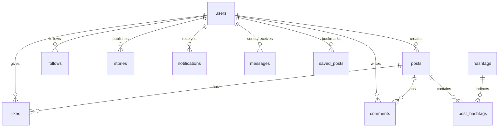

# 📖 VibeGrid — Complete Technology Stack, Architecture & Implementation Guide

> **Project Name**: VibeGrid  
> **Author**: Atul Yadav  
> **Platform**: Modern Full-Stack Social Media Web Application  
> **Architecture**: Decoupled Client-Server (React SPA + Express REST API + PostgreSQL Database)  
> **Documentation Location**: `/Users/atulyadav/Learning/docs/`

---

## 1. Executive Summary & Product Overview

**VibeGrid** is a modern, responsive social media platform inspired by Instagram and Threads. It provides photo storytelling, 24-hour ephemeral stories with interactive reactions, chronological home feeds with close-friends filtering, a desktop suggestion & trending sidebar, direct messaging, user discovery, hashtag topic feeds, and customizable dark/light themes.

---

## 2. Complete Technology Stack

| Layer | Technology | Version | Purpose in VibeGrid |
|---|---|---|---|
| **Frontend Framework** | React | `^18.3.1` | Component-based interactive UI with Context API state management |
| **Frontend Bundler** | Vite | `^5.4.2` | Fast HMR dev server and optimized production build bundling |
| **Icons** | Lucide React | `^0.439.0` | Lightweight SVG icons for navigation, actions, and indicators |
| **Client Routing** | Custom Tab & Modal Router | Custom | Instant, flicker-free client navigation without full-page reloads |
| **HTTP Communication** | Fetch API (`apiClient.js`) | Native | Centralized HTTP client sending secure HTTP-Only cookies with credentials |
| **Backend Runtime** | Node.js | `>= 18.0` | Asynchronous JavaScript runtime environment |
| **Web API Framework** | Express.js | `^4.19.2` | REST API routing, middleware pipeline, and JSON request processing |
| **Relational Database** | PostgreSQL | Neon Cloud / `pg 8.12.0` | ACID-compliant relational data storage, foreign keys, and indexes |
| **Database Driver** | `pg` (node-postgres) | `^8.12.0` | High-performance connection pooling and parameterized SQL queries |
| **Password Hashing** | `bcrypt` | `^5.1.1` | Cryptographic adaptive salted hashing with 12 salt rounds |
| **Token Authentication** | `jsonwebtoken` (JWT) | `^9.0.2` | Signed stateless session tokens (7-day validity) |
| **Cookie Parsing** | `cookie-parser` | `^1.4.6` | Parsing HTTP-Only session cookies (`vibegrid_token`) |
| **API Security Headers** | `helmet` | `^7.1.0` | Secures HTTP headers, XSS filtering, CSP, and CORS isolation |
| **CORS Management** | `cors` | `^2.8.5` | Strict Origin whitelisting with credentials permission |
| **Rate Limiting** | `express-rate-limit` | `^7.3.1` | Throttles brute-force attempts on sensitive endpoints |
| **File / Media Uploads** | `multer` | `^1.4.5-lts.1` | Multipart form-data handling with disk storage and MIME validation |
| **Configuration** | `dotenv` | `^16.4.5` | Centralized environment variable management |
| **Development Tool** | `nodemon` | `^3.1.4` | Auto-restarts backend server on file changes |

---

## 3. Architecture & Codebase Structure

```
Ai-Learning/Social_Media_Project/
├── client/                     # Frontend Application (React + Vite)
│   ├── index.html              # Single Page Application HTML root
│   ├── vite.config.js          # Vite configuration and plugins
│   ├── package.json            # Client dependencies
│   └── src/
│       ├── main.jsx            # React root mount point
│       ├── App.jsx             # Top navbar, bottom mobile nav, layout router
│       ├── api/
│       │   └── client.js       # Reusable Fetch API client with credentials
│       ├── context/
│       │   └── AuthContext.jsx # Global auth provider, session check, localStorage
│       ├── pages/
│       │   ├── AuthPage.jsx    # Login, registration, demo chips, modal dialogs
│       │   ├── FeedPage.jsx    # 2-column home feed with stories & sidebar
│       │   ├── ExplorePage.jsx # Trending hashtags, user search, 3-column mosaic
│       │   ├── MessagesPage.jsx# 1-on-1 private direct messaging
│       │   └── ProfilePage.jsx # User profile, bio, stats, and saved bookmarks
│       ├── components/
│       │   ├── FeedSidebar.jsx # Desktop right sidebar (Suggestions & Trending)
│       │   ├── StoryTray.jsx   # Horizontal stories bar with Close Friends rings
│       │   ├── StoryViewerModal.jsx # Story viewer with reactions & reply drawer
│       │   ├── CommentsModal.jsx    # Comments thread with real-time posting
│       │   ├── HashtagFeedModal.jsx # Topic explorer for specific #tags
│       │   ├── NotificationsModal.jsx # Activity notification drawer
│       │   ├── CreatePostModal.jsx  # Photo upload with drag-and-drop & caption
│       │   ├── CreateStoryModal.jsx # 24-hour story media creator
│       │   └── StatusDashboard.jsx  # System health & database diagnostics
│       ├── styles/
│       │   └── index.css       # Unified design system (tokens, dark/light themes)
│       └── utils/
│           └── textFormatters.jsx # Regex parser for #hashtags and @mentions
│
├── server/                     # Backend Application (Node.js + Express)
│   ├── package.json            # Server dependencies
│   ├── uploads/                # Local disk storage for avatars, posts, and stories
│   └── src/
│       ├── server.js           # Server entry point, middleware pipeline, health check
│       ├── config/
│       │   ├── env.js          # Environment variable parser
│       │   └── db.js           # PostgreSQL connection pool with query helpers
│       ├── db/
│       │   ├── schema.sql      # 10 relational tables, indexes, and constraints
│       │   └── seedRealisticFeeds.js # Seeding script (10 personas, posts, stories)
│       ├── controllers/
│       │   ├── authController.js       # Register, login, logout, me
│       │   ├── userController.js       # Profiles, avatar uploads, search, suggestions
│       │   ├── postController.js       # Feed, post creation, deletion, saves
│       │   ├── storyController.js      # Active stories, upload, 24h expiration
│       │   ├── engagementController.js # Likes, comments, real-time counters
│       │   ├── followController.js     # Follow/unfollow toggle, social graph
│       │   ├── messageController.js    # 1-on-1 direct messaging, unread counts
│       │   ├── notificationController.js # Activity alerts
│       │   └── hashtagController.js    # Trending tags, topic-based feeds
│       ├── routes/
│       │   ├── authRoutes.js
│       │   ├── userRoutes.js
│       │   ├── postRoutes.js
│       │   ├── storyRoutes.js
│       │   ├── messageRoutes.js
│       │   ├── notificationRoutes.js
│       │   └── hashtagRoutes.js
│       ├── middlewares/
│       │   ├── authMiddleware.js     # protect (JWT guard) & optionalAuth
│       │   ├── validateMiddleware.js # Input sanitization & regex validation
│       │   └── uploadMiddleware.js   # Multer file limits and disk storage
│       └── utils/
│           ├── jwt.js                # Token signing & HTTP-Only cookie handlers
│           └── password.js           # bcrypt hash & compare utilities
```

---

## 4. In-Depth Explanation of Every Package & Tool

### Backend Packages

#### 1. `express` (`^4.19.2`)
- **Why we use it**: Lightweight and flexible Node.js web server framework.
- **How it works**: Manages the middleware pipeline (parsers, guards, error handlers) and routes HTTP requests (`GET`, `POST`, `PUT`, `DELETE`) to corresponding controllers.

#### 2. `pg` (`^8.12.0`)
- **Why we use it**: Official non-blocking PostgreSQL client for Node.js.
- **How it works**: Creates a connection pool (`new Pool()`) managing up to 20 concurrent connections. All queries use parameterized statements (`$1`, `$2`) to completely eliminate SQL injection risks.

#### 3. `bcrypt` (`^5.1.1`)
- **Why we use it**: Industry-standard cryptographic adaptive password hashing.
- **How it works**: Generates a random cryptographic salt and runs 12 hashing rounds (`SALT_ROUNDS = 12`). It is computationally expensive by design, protecting against brute-force and rainbow table attacks.

#### 4. `jsonwebtoken` (`^9.0.2`)
- **Why we use it**: Stateless authentication tokens without server-side session memory.
- **How it works**: Signs a payload containing `{ id: user.id, username: user.username }` using `JWT_SECRET` with a 7-day expiration (`jwtExpiresIn: '7d'`). The signature is verified on every protected request.

#### 5. `cookie-parser` (`^1.4.6`)
- **Why we use it**: Extracts and parses cookies from incoming HTTP request headers.
- **How it works**: Reads the `Cookie` header and populates `req.cookies.vibegrid_token` so the `protect` middleware can verify authentication.

#### 6. `cors` (`^2.8.5`)
- **Why we use it**: Cross-Origin Resource Sharing security.
- **How it works**: Restricts browser requests to only allow the frontend URL (`http://localhost:5173`) with `credentials: true`. This allows HTTP-Only cookies to travel safely between the client and server.

#### 7. `helmet` (`^7.1.0`)
- **Why we use it**: Sets 14+ essential HTTP response security headers.
- **How it works**: Mitigates Cross-Site Scripting (XSS), clickjacking (`X-Frame-Options`), MIME-sniffing, and cross-origin resource policy (`crossOriginResourcePolicy: { policy: "cross-origin" }` to allow loading uploaded user images).

#### 8. `express-rate-limit` (`^7.3.1`)
- **Why we use it**: Prevents brute-force credential stuffing attacks.
- **How it works**: Tracks IP request counts in a 15-minute sliding window (`windowMs: 15 * 60 * 1000`). If more than 10 failed login attempts are made, it responds with `429 Too Many Requests`.

#### 9. `multer` (`^1.4.5-lts.1`)
- **Why we use it**: Processes `multipart/form-data` file uploads.
- **How it works**: Validates file MIME types (`image/jpeg`, `image/png`, `image/webp`), limits file sizes (up to 10MB), and stores files on disk with unique filenames in `uploads/avatars/`, `uploads/posts/`, or `uploads/stories/`.

#### 10. `dotenv` (`^16.4.5`)
- **Why we use it**: Zero-dependency environment variable loader.
- **How it works**: Loads `.env` file variables into `process.env` at server initialization.

---

### Frontend Packages & Tools

#### 1. `react` & `react-dom` (`^18.3.1`)
- **Why we use it**: Declarative UI component library with Virtual DOM reconciliation.
- **How it works**: Manages component lifecycles, hooks (`useState`, `useEffect`, `useCallback`, `useContext`), and state changes for fast, reactive UI updates.

#### 2. `vite` (`^5.4.2`)
- **Why we use it**: Next-generation frontend build tool replacing legacy Webpack.
- **How it works**: Uses native ES modules during development for sub-50ms Hot Module Replacement (HMR) and bundles optimized assets via Rollup in ~500ms.

#### 3. `lucide-react` (`^0.439.0`)
- **Why we use it**: Clean, scalable SVG icons designed for modern user interfaces.

#### 4. `apiClient.js` (Custom Fetch Wrapper)
- **Why we use it**: Centralized HTTP client.
- **How it works**: Automatically sets `{ credentials: 'include' }` on every request so browser HTTP-Only cookies are sent and received seamlessly without storing JWTs in vulnerable JavaScript `localStorage`.

---

## 5. PostgreSQL Database Schema (10 Relational Tables)



### Table Breakdown

1. **`users`**:
   - `id SERIAL PRIMARY KEY`
   - `username VARCHAR(30) UNIQUE NOT NULL`
   - `email VARCHAR(255) UNIQUE NOT NULL`
   - `password_hash VARCHAR(255) NOT NULL` (bcrypt)
   - `full_name VARCHAR(100)`
   - `bio VARCHAR(150)`
   - `avatar_url TEXT`
   - `created_at`, `updated_at`

2. **`posts`**:
   - `id SERIAL PRIMARY KEY`
   - `user_id INTEGER NOT NULL REFERENCES users(id) ON DELETE CASCADE`
   - `image_url TEXT NOT NULL`
   - `caption TEXT`
   - `created_at TIMESTAMP` (Indexed DESC)

3. **`likes`**:
   - `id SERIAL PRIMARY KEY`
   - `user_id INTEGER REFERENCES users(id) ON DELETE CASCADE`
   - `post_id INTEGER REFERENCES posts(id) ON DELETE CASCADE`
   - `UNIQUE(user_id, post_id)` prevents duplicate likes

4. **`comments`**:
   - `id SERIAL PRIMARY KEY`
   - `user_id INTEGER REFERENCES users(id) ON DELETE CASCADE`
   - `post_id INTEGER REFERENCES posts(id) ON DELETE CASCADE`
   - `comment_text VARCHAR(500) NOT NULL`
   - `created_at TIMESTAMP`

5. **`follows`**:
   - `follower_id INTEGER REFERENCES users(id) ON DELETE CASCADE`
   - `following_id INTEGER REFERENCES users(id) ON DELETE CASCADE`
   - `PRIMARY KEY (follower_id, following_id)`
   - `CHECK (follower_id <> following_id)` prevents following oneself

6. **`stories`**:
   - `id SERIAL PRIMARY KEY`
   - `user_id INTEGER REFERENCES users(id) ON DELETE CASCADE`
   - `media_url TEXT NOT NULL`
   - `created_at TIMESTAMP DEFAULT CURRENT_TIMESTAMP`
   - `expires_at TIMESTAMP DEFAULT (CURRENT_TIMESTAMP + INTERVAL '24 hours')`

7. **`notifications`**:
   - `id SERIAL PRIMARY KEY`
   - `recipient_id INTEGER REFERENCES users(id) ON DELETE CASCADE`
   - `sender_id INTEGER REFERENCES users(id) ON DELETE CASCADE`
   - `type VARCHAR(30)` ('like', 'comment', 'follow')
   - `post_id INTEGER REFERENCES posts(id)`
   - `comment_text VARCHAR(200)`
   - `is_read BOOLEAN DEFAULT FALSE`

8. **`messages`**:
   - `id SERIAL PRIMARY KEY`
   - `sender_id INTEGER REFERENCES users(id) ON DELETE CASCADE`
   - `recipient_id INTEGER REFERENCES users(id) ON DELETE CASCADE`
   - `content TEXT NOT NULL`
   - `is_read BOOLEAN DEFAULT FALSE`
   - `created_at TIMESTAMP`

9. **`saved_posts`**:
   - `id SERIAL PRIMARY KEY`
   - `user_id INTEGER REFERENCES users(id) ON DELETE CASCADE`
   - `post_id INTEGER REFERENCES posts(id) ON DELETE CASCADE`
   - `UNIQUE(user_id, post_id)`

10. **`hashtags` & `post_hashtags`**:
    - `hashtags`: `id`, `name VARCHAR(50) UNIQUE NOT NULL`, `created_at`
    - `post_hashtags`: `post_id`, `hashtag_id`, `PRIMARY KEY (post_id, hashtag_id)`

---

## 6. Major Features Implemented

### 1. Dual-Column Responsive Feed & Desktop Sidebar
- **Main Feed Column (580px)**: Chronological photo timeline, double-tap to like with heart animation, 1-tap emoji reactions (`❤️`, `🔥`, `👏`, `😍`, `😂`, `🥳`), inline quick-comment bar.
- **Desktop Right Sidebar (320px)**:
  - **User Chip**: Quick avatar and profile link.
  - **Suggestions For You**: Lists un-followed users with instant **Follow / Following** toggle.
  - **Trending Topics**: Top hashtags with formatted counters (e.g. `#travel 12.4K posts`).
  - **Responsive Breakpoint (`990px`)**: Automatically hidden on mobile and tablets.

### 2. 24-Hour Ephemeral Stories & Close Friends
- Automatic 24-hour expiration query: `WHERE expires_at > NOW()`.
- Interactive story viewer modal with 5-second auto-progress bar.
- Floating reaction pill (`🔮`, `👀`, `🥳`) with particle burst engine.
- Quick direct message reply drawer (typing pauses story timer automatically).
- **Close Friends (★)**: Star button on feed posts and story viewer, green gradient ring (`#10b981`) on story tray avatars, and feed filtering toggle (`All Posts` vs `★ Close Friends`).

### 3. Topic Discovery & Hashtags
- Automated regex hashtag extraction on post creation: `/#([A-Za-z0-9_]+)/g`.
- Trending hashtags endpoint with aggregation: `COUNT(ph.post_id)::int AS post_count`.
- Dedicated `HashtagFeedModal` with 3-column media grid.

### 4. Direct Messaging (1-on-1 Chat)
- Adaptive dual-pane on desktop, single-pane with back button on mobile.
- Unread message badge polling in header and bottom nav.

---

## 7. Complete API Reference

| Endpoint | Method | Auth Guard | Description |
|---|---|---|---|
| `/api/auth/register` | `POST` | Public | Register a new account with email, username, password |
| `/api/auth/login` | `POST` | Public (Rate-limited) | Login with username/email & password; sets HTTP-Only cookie |
| `/api/auth/logout` | `POST` | Public | Clears session cookie |
| `/api/auth/me` | `GET` | `protect` | Returns currently logged-in user profile |
| `/api/users/suggestions` | `GET` | `optionalAuth` | Returns suggested users not yet followed |
| `/api/users/search?q=...` | `GET` | `optionalAuth` | Search creators by username or full name |
| `/api/users/:username` | `GET` | `optionalAuth` | Public profile stats (followers, following, posts) |
| `/api/users/:username/follow-toggle` | `POST` | `protect` | Toggle follow / unfollow on target user |
| `/api/posts/feed` | `GET` | `optionalAuth` | Chronological home feed with like & save state |
| `/api/posts` | `POST` | `protect` | Upload new photo post with optional caption |
| `/api/posts/:id/like` | `POST` | `protect` | Toggle like on post |
| `/api/posts/:id/save` | `POST` | `protect` | Bookmark / save post to private collection |
| `/api/posts/:id/comments` | `POST` | `protect` | Add comment to post |
| `/api/stories/active` | `GET` | `optionalAuth` | Fetch grouped unexpired stories for tray |
| `/api/stories` | `POST` | `protect` | Publish 24-hour story |
| `/api/hashtags/trending` | `GET` | Public | Get top 25 trending hashtags sorted by post count |
| `/api/hashtags/:tag/posts` | `GET` | `optionalAuth` | Get all media posts tagged with `#tag` |
| `/api/messages/:username` | `GET` / `POST`| `protect` | Fetch conversation history / Send direct message |
| `/api/notifications` | `GET` | `protect` | Fetch user activity alerts |
| `/api/health` | `GET` | Public | Database and server diagnostics endpoint |

---

## 8. Summary of Authentication Audit & Remediation Status

| Area | Audit Finding | Severity | Phase & Status | Remediation Applied |
|---|---|---|---|---|
| **Password Max Length** | None (Unbounded) | **CRITICAL** | **Phase 1: FIXED** | Enforced 128 character max on register & login to prevent Hash DoS |
| **Login Validation** | Missing middleware, crash on non-string | **HIGH** | **Phase 1: FIXED** | Created `validateLogin` middleware with strict type and length bounds |
| **Registration Limiter**| None (Bot spam signups) | **HIGH** | **Phase 1: FIXED** | Added `registerLimiter` (10 accounts/hour/IP) via `express-rate-limit` |
| **Reverse Proxy Support**| `trust proxy` disabled | **HIGH** | **Phase 1: FIXED** | Enabled `app.set('trust proxy', 1)` for accurate rate-limiting IPs |
| **Cookie Clearing Flags**| Missing `secure` and `path: '/'` on clear | **MEDIUM**| **Phase 1: FIXED** | Added matching `secure`, `sameSite`, and explicit `path: '/'` attributes |
| **Token Revocation** | Stateless 7d JWT cannot be revoked | **MEDIUM** | **Phase 2: FIXED** | Added `token_version` to DB; tokens revoked immediately upon logout |
| **Client 401 Handling** | Retains stale user in localStorage | **MEDIUM** | **Phase 2: FIXED** | Intercept 401s in `apiClient` via event bus to auto-clear session & redirect |
| **Account Lockout** | IP-only limiter | **HIGH** | **Phase 2/3** | Add 5-attempt account-based temporary lockout in PostgreSQL |
| **Form Validation** | Fabricates `@vibegrid.io`, no confirm pass| **MEDIUM** | **Phase 3** | Require real email, add confirm password, real-time match |
| **UX & Password Meter** | No strength visual feedback | **LOW** | **Phase 4** | Interactive password strength meter and inline error indicators |
| **Forgot Password / OTP**| Static demo modal | **GAP** | **Phase 5** | Database tables & email delivery for real reset & OTP tokens |

---

## 9. How to Run the Application

```bash
# 1. Install all dependencies for both client and server
npm run install:all

# 2. Start the Express backend server (port 5000)
npm run server

# 3. In a separate terminal, start the React Vite client (port 5173)
npm run client
```

- **Frontend**: `http://localhost:5173`
- **Backend API**: `http://localhost:5000`
- **Health Check**: `http://localhost:5000/api/health`
